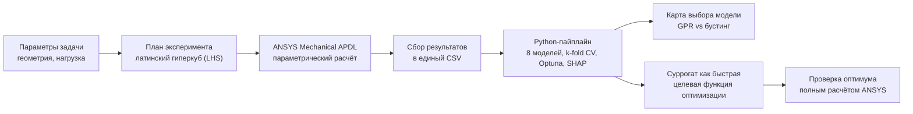

# 🧪 fea-surrogate-benchmark

**Суррогатные модели для конечно-элементного анализа (МКЭ): когда выигрывает GPR, а когда - градиентный бустинг.**

Comparative analysis of regression models for approximating physical processes in mechanics.


---

## 🎯 Проблема и для кого это

Конечно-элементный анализ (МКЭ) - основной инструмент прочностного расчёта, но один расчёт занимает от секунд до минут, а параметрическое исследование или оптимизация конструкции требуют сотен и тысяч расчётов. Это дорого по времени.

**Идея:** обучить регрессионную модель-суррогат один раз на наборе МКЭ-расчётов, а дальше предсказывать отклик за миллисекунды - на 2-3 порядка быстрее полного расчёта.

**Для кого:** инженеры-расчётчики (CAE), которым нужно быстро перебирать геометрию и нагрузки; специалисты по редуцированным моделям (ROM).

**Вопрос работы:** какую регрессионную модель брать в суррогат? В прикладном табличном ML по умолчанию берут градиентный бустинг (XGBoost, LightGBM, CatBoost). Проект проверяет это предположение на реальных инженерных данных ANSYS.

## 🔑 Находка

Выбор модели-суррогата определяется **гладкостью отклика**:

- на гладких упругих задачах и малых выборках лучшая - регрессия гауссовских процессов (**GPR**), она обгоняет даже современный бустинг;
- на резком (резонансном) отклике GPR теряет первое место - её обходит **градиентный бустинг** (CatBoost R² = 0,61 против GPR 0,45).

Всё показано на собственных данных ANSYS, а не на синтетике.

## 📊 Результаты

R² по k-блочной кросс-валидации (ансамбли деревьев настроены Optuna):

| Задача | Режим отклика | GPR | Лучший бустинг | Лидер |
|---|---|---|---|---|
| Кирш, 100 точек | гладкий | 1,00 | 0,98 | GPR |
| Кирш, 30 точек | гладкий, малая выборка | 0,99 | ≤ 0,86 | GPR |
| Консоль, 80 точек | гладкий | 0,99 | 0,84 | GPR |
| Консоль, 240 точек | гладкий | 0,90 | 0,83 | GPR |
| Пластичность, 200 точек | пороговый | 0,99 | 0,85 | GPR |
| Консоль, 120 точек (экстрим-диапазон) | жёсткий | 0,76 | 0,88 | бустинг |
| Резонанс, 200 точек | резкий | 0,45 | 0,61 (CatBoost) | бустинг |

**Практический итог - карта выбора модели:** GPR для гладких откликов и малых выборок; градиентный бустинг для резких, резонансных и сильно разбросанных откликов.

## 🏗 Архитектура пайплайна



Данные и обучение разделены: любой набор ANSYS-расчётов подаётся в один и тот же воспроизводимый Python-пайплайн.

## 🗂 Структура репозитория

```
src/            ML-ядро
  models.py       зоопарк из 8 регрессионных моделей
  benchmark.py    k-fold кросс-валидация + метрики
  tune.py         байесовский тюнинг деревьев (Optuna)
  synthetic.py    синтетические функции контроля гладкости
  run_all.py      прогон всех задач + таблица кроссовера
  optimize.py     оптимизация конструкции на суррогате
apdl/           параметрические макросы ANSYS (Кирш, консоль, пластика, резонанс)
fea/            генерация выборок и запуск ANSYS
  scripts_cantilever/  пайплайн упругой консоли: DOE -> ANSYS -> обучение -> графики
  scripts_kirsch/      пайплайн задачи Кирша
  optimization/        оптимизация + проверка оптимума в ANSYS
  run_*_ansys.py       запуск пластики и резонанса (.bat - обёртка для Windows)
data/           готовые выборки (CSV) по всем задачам
docs/           отчёт, рисунки, описание проекта
app/            Streamlit-демо
tests/          smoke-тесты
```

## 🧰 Стек и модели

- **Данные:** ANSYS Mechanical APDL (элемент PLANE182, плоское напряжённое состояние), план эксперимента - латинский гиперкуб (LHS).
- **8 моделей:** Ridge, GPR, MLP (нейросеть), RandomForest, GradientBoosting (sklearn), XGBoost, LightGBM, CatBoost.
- **ML-стек:** Python, scikit-learn, XGBoost, LightGBM, CatBoost, Optuna (тюнинг), SHAP (интерпретация).
- **Валидация:** k-блочная кросс-валидация (5 блоков x 3 сида), метрики R², MAE, RMSE, MAPE.
- **Инженерия:** Docker, GitHub Actions (CI: линт + тесты), pytest, config-driven пайплайн, Streamlit-демо.

## 🚀 Быстрый старт

```bash
pip install -r requirements.txt
python -m src.run_all               # прогон всех задач -> таблица кроссовера
python -m src.benchmark             # синтетический бенчмарк -> results/benchmark.csv
python -m src.optimize              # демо оптимизации на суррогате
streamlit run app/streamlit_app.py  # интерактивное демо
pytest -q                           # тесты
```

Переменные окружения не нужны - проект работает из коробки на готовых CSV в `data/`.

## 🐳 Docker

```bash
docker build -t surrogate .
docker run --rm -v $PWD/results:/app/results surrogate
```

## 🤖 Применение ИИ

Проект применяет ИИ на двух уровнях:

1. **Ядро проекта - прикладной ML:** восемь регрессионных моделей как суррогаты МКЭ, автоматический подбор гиперпараметров (Optuna), интерпретация признаков (SHAP).
2. **ИИ-инструменты в разработке:** сборка воспроизводимого пайплайна, каркас бенчмарка, генерация графиков и черновиков документации ускорены ИИ-ассистентом (Claude / Cowork). Постановка задач, конечно-элементные модели ANSYS и интерпретация результатов - авторские.

## 🧭 Соответствие критериям конкурса

| Критерий | Где в проекте |
|---|---|
| Разработка и инженерия | Git, Docker, GitHub Actions CI, pytest, config-driven пайплайн |
| Data Science | 8 моделей, k-fold CV, Optuna, SHAP, метрики, анализ откликов |
| Применение ИИ | ML-ядро (суррогаты) + ИИ-инструменты разработки |
| Продуктовое мышление | дорогой МКЭ -> суррогат x1000, ЦА - инженеры-расчётчики, карта выбора модели |
| Мотивация | мотивационное письмо (отдельный документ) |

## ⚠️ Честные ограничения

- Суррогат достоверен только внутри обучающего диапазона параметров; итоговое инженерное решение проверяется полным расчётом ANSYS.
- На резких и резонансных откликах точность объективно ниже (R² около 0,45-0,61): здесь бустинг лучше GPR, но задача трудна для любой модели.
- Гипотеза о безусловном превосходстве ансамблей деревьев на табличных данных не подтвердилась: на гладких МКЭ-суррогатах их обгоняет GPR.

## 📄 Данные и происхождение

Все выборки - собственные расчёты ANSYS Mechanical APDL. Часть выборок исходно формировалась вспомогательным модулем автоматизации (RomAI), но итоговый пайплайн сравнения полностью переписан на открытом Python ради воспроизводимости и полного контроля методики.

## 📚 Подробнее

Полная методика, постановки задач и результаты с рисунками - в отчёте `docs/Отчёт_суррогаты_МКЭ.md`.
