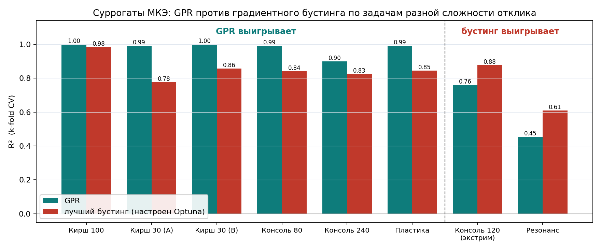

# Регрессионные суррогаты конечно-элементного анализа: когда выигрывает гауссовский процесс, а когда градиентный бустинг

**Автор:** Савинцев Александр Витальевич
**Репозиторий:** github.com/<логин>/<репо>

## 1. Проблема и актуальность

Конечно-элементный анализ (МКЭ) - основной инструмент инженера-расчётчика, но один
расчёт занимает секунды-минуты, а параметрические исследования и оптимизация требуют
сотен и тысяч расчётов. Суррогатная модель машинного обучения обучается один раз на
наборе расчётов и затем предсказывает отклик за миллисекунды, ускоряя перебор вариантов
на порядки.

Практический вопрос, на который нет однозначного ответа в литературе и который решается
в этой работе: **какую регрессионную модель выбирать для суррогата МКЭ?** В табличном
машинном обучении по умолчанию ожидают победы градиентного бустинга (XGBoost, LightGBM,
CatBoost). Цель работы - проверить это для инженерных МКЭ-данных и определить границу
применимости моделей.

## 2. Данные

Все данные получены собственной автоматизированной цепочкой: параметрическая модель в
ANSYS Mechanical APDL (элемент PLANE182), план эксперимента методом латинского гиперкуба
(LHS), пакетный прогон расчётов, сборка в единый датасет. Рассмотрены задачи с откликом
разной гладкости:

| Задача | Тип отклика | Точек | Вход / выход |
|---|---|---|---|
| Кирш (пластина с отверстием) | гладкий упругий | 100 + 2×30 | a,b,lx,ly / σ_max |
| Консоль, упругий изгиб | гладкий | 80 / 120 / 240 | L,h,b,F / σ_max |
| Консоль, упругопластический изгиб | пороговый (излом) | 200 | L,h,b,F / ε_pl |
| Консоль, гармонический резонанс | резкий (пик) | 200 | L,h,b,F / амплитуда |
| Синтетические функции | контроль гладкости | 4×400 | 4D / скаляр |

Упругая и пластическая консоль - одна геометрия при разных режимах физики; резонансная
задача (гармонический анализ на фиксированной частоте) даёт настоящую негладкость -
острый пик амплитуды там, где собственная частота совпадает с частотой возбуждения.
Синтетические функции (гладкая степенная, пороговая, разрывная, высокочастотная,
резонансная) служат контролем и объясняют механизм.

## 3. Методы

Единый воспроизводимый пайплайн на Python (scikit-learn). Сравниваются восемь моделей:
Ridge-регрессия, регрессия гауссовских процессов (GPR), многослойная нейронная сеть,
случайный лес, а также градиентный бустинг в четырёх реализациях (scikit-learn,
**XGBoost, LightGBM, CatBoost**).

Оценка качества - по k-fold кросс-валидации (5 блоков, 3 сида) с метриками R², MAE, RMSE,
MAPE. Гиперпараметры ансамблей деревьев настраиваются автоматически (Optuna); GPR
самонастраивается по методу максимума правдоподобия ядра - это обеспечивает честное
сравнение. Влияние параметров интерпретируется методом SHAP.

*Происхождение.* Задача выросла из выпускной работы, где суррогаты строились в том числе
проприетарным инструментом RomAI (интегрирован с ANSYS). Для этого проекта весь пайплайн
переписан в открытом воспроизводимом виде на Python; результаты RomAI служат внешней
валидацией и согласуются с Python-расчётами.

## 4. Результаты: где выигрывает GPR, а где градиентный бустинг

Модели сравниваются по k-fold CV; ансамбли деревьев настроены Optuna (итоговая строгая
таблица - `results/crossover_tuned.csv`). Картина - спектр по сложности/резкости отклика,
а не жёсткая граница (R² по CV):

- **Гладкие, хорошо обусловленные задачи и малые выборки - лучшая GPR.** Кирш (100 точек):
  GPR 1.00 против 0.98 у лучшего дерева. На малых выборках преимущество резкое: на 30 точках
  GPR даёт 0.99, тогда как настроенные ансамбли деревьев - не выше 0.86. Это практически
  важно: обучающие выборки МКЭ малы (расчёты дороги), и именно там GPR доминирует, причём
  устойчиво к тюнингу.
- **Пластичность (мягкий излом) - GPR держится:** 0.99 против ≤0.85 у бустинга.
  Один порог текучести - слишком слабая негладкость, гладкий интерполятор её переваривает.
- **Резонанс (резкий пик) - GPR теряет первое место:** CatBoost 0.61 и LightGBM 0.50
  обходят GPR 0.45. Результат устойчив к тюнингу Optuna - это не артефакт
  «недонастроенных деревьев», а реальная смена лидера.
- **Расширенный диапазон (тонкие короткие балки, большой разброс отклика) - бустинг
  обгоняет:** на выборке с экстремальными геометриями настроенный CatBoost 0.88 против
  GPR 0.76.

Синтетический контроль подтверждает механизм: на гладкой и пороговой функциях побеждает
GPR, на разрывной и резонансной - деревья и нейросеть.

**Вывод, вопреки табличному мейнстриму:** на гладких МКЭ-суррогатах современный бустинг
проигрывает GPR, особенно на малых выборках. Граница смены лидера проходит по гладкости
отклика: как только отклик становится резким (резонанс), выигрывает градиентный бустинг.
Это показано не только на синтетике, но и на реальной конечно-элементной задаче.

## 5. Применение: оптимизация на суррогате

Лучший суррогат используется как быстрая целевая функция для инженерной оптимизации:
на GPR-модели задачи Кирша решаются задачи минимизации напряжения и площади при
ограничениях, а найденный оптимум проверяется полным расчётом ANSYS. Одно предсказание
выполняется за миллисекунды против секунд-минут на полный расчёт, что делает перебор
тысяч вариантов практически осуществимым.

**Практическая рекомендация:** для суррогатов гладких упругих МКЭ-откликов дефолт - GPR
(особенно при малых выборках); для резких/резонансных откликов - градиентный бустинг.

## 6. Инженерия и воспроизводимость

Проект оформлен как чистый репозиторий: config-driven пайплайн, Docker, CI (GitHub Actions,
линт + тесты), трекинг экспериментов, unit-тесты, Streamlit-демо «обучи суррогат и
сравни модели». Полный прогон бенчмарка - одна команда (`python -m src.run_all`),
результаты воспроизводимы по фиксированным сидам.

## 7. Итог

Построена сквозная воспроизводимая система сравнения регрессионных суррогатов МКЭ на
задачах механики разной гладкости, с собственными данными ANSYS и честной методикой
(кросс-валидация, тюнинг, интерпретация). Главный результат - карта применимости моделей
с чёткой границей: GPR для гладких откликов и малых выборок, градиентный бустинг для
резких/резонансных. Гипотеза о превосходстве бустинга подтвердилась лишь частично и
только за границей гладкости - это честный, проверенный экспериментом вывод с прямой
инженерной пользой.
