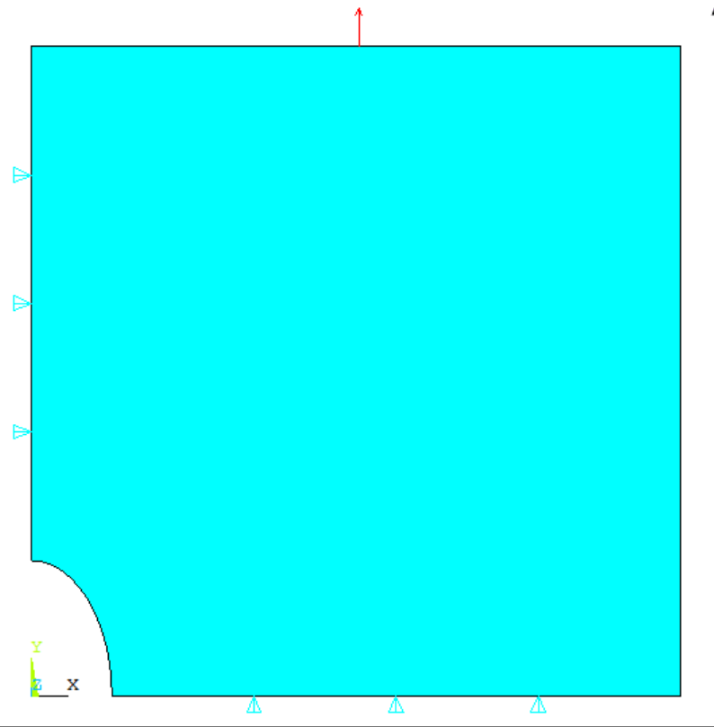
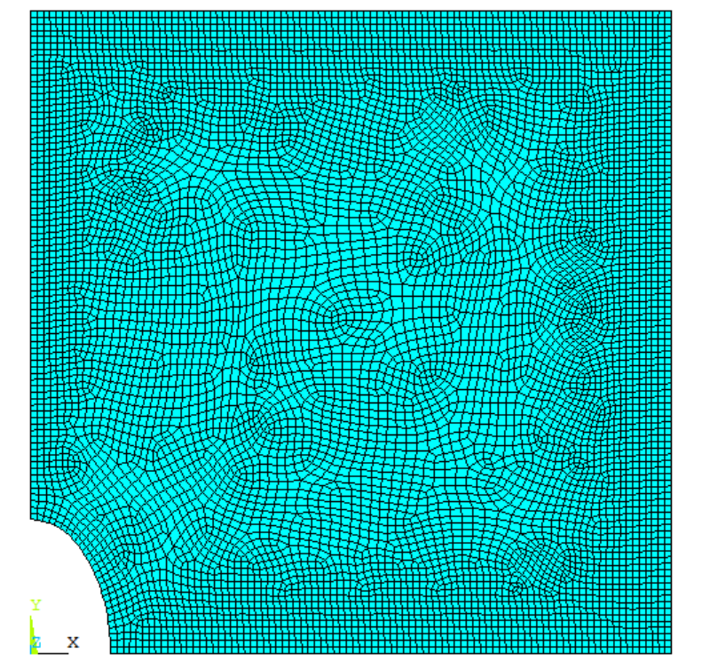
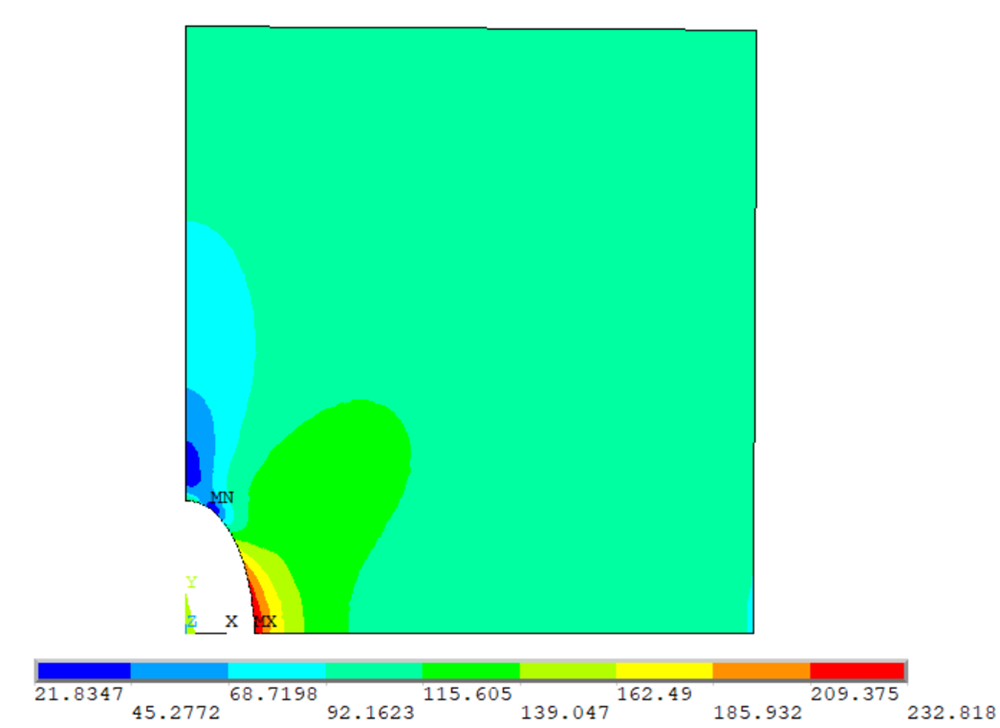
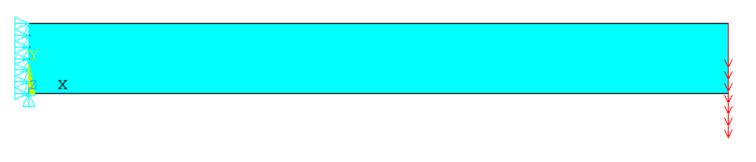
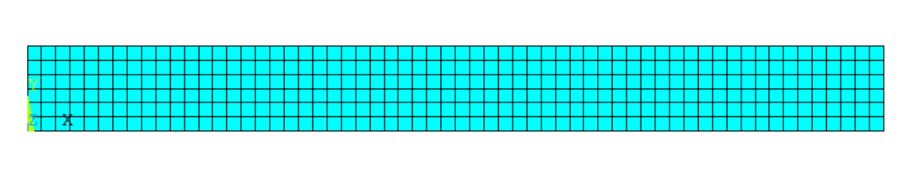
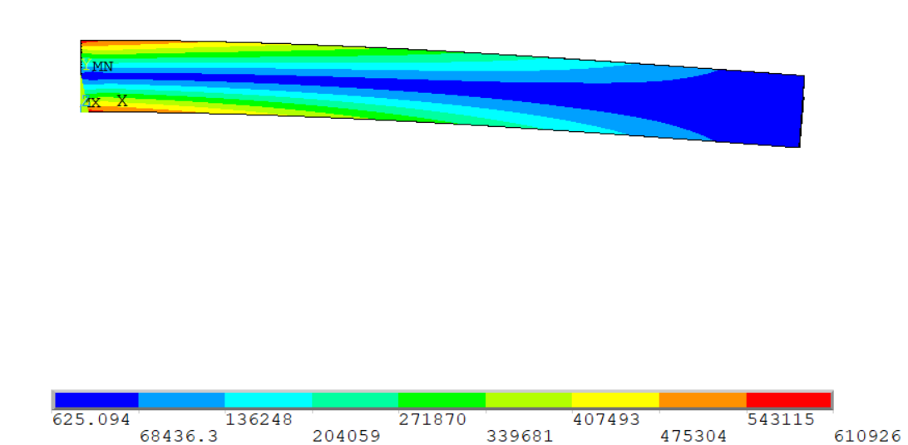
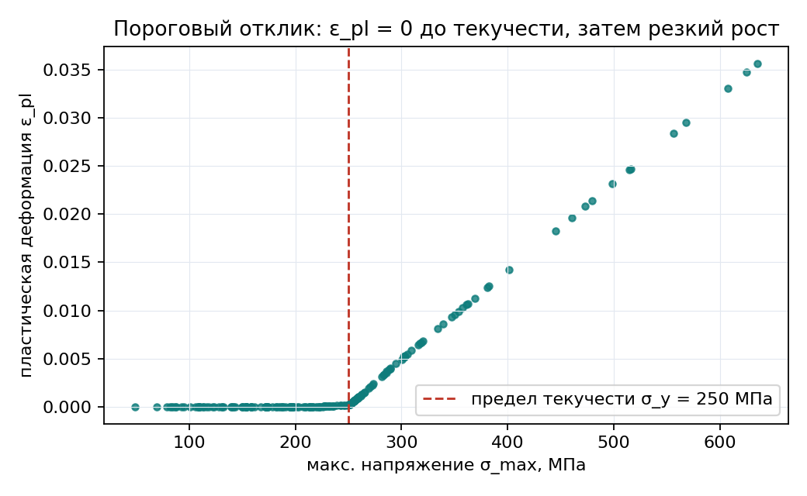
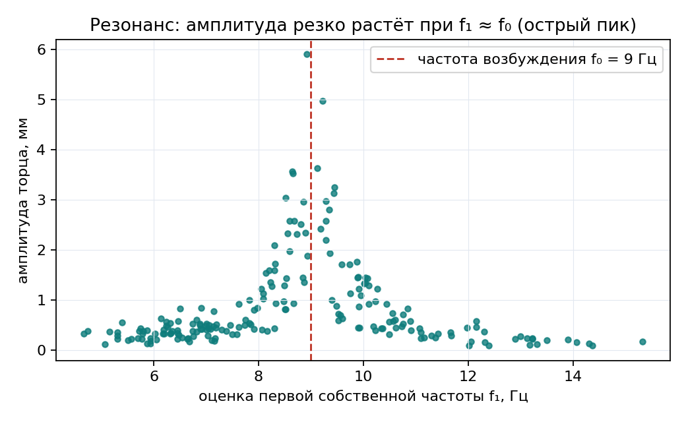
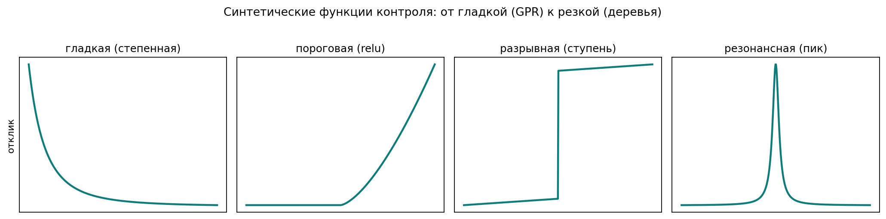

% Сравнительный анализ регрессионных суррогатов конечно-элементного анализа в задачах механики
% Савинцев Александр Витальевич
% 2026

## Аннотация

Работа посвящена суррогатному (редуцированному) моделированию отклика конечно-элементных
(КЭ) расчётов в задачах механики. Построена автоматизированная цепочка ANSYS Mechanical APDL -
план эксперимента (латинский гиперкуб) - обучение и сравнение восьми регрессионных моделей.
На пяти классах задач с откликом разной гладкости (концентрация напряжений, упругий изгиб,
упругопластический изгиб с порогом текучести, гармонический резонанс, синтетические функции)
показано, что выбор модели-суррогата определяется гладкостью и обусловленностью отклика:
на гладких задачах и малых выборках наилучшее качество даёт регрессия гауссовских процессов
(GPR), а градиентный бустинг обгоняет её только на резких (резонансных) откликах. Лучший
суррогат применён для инженерной оптимизации с проверкой полным КЭ-расчётом.

## 1. Введение

Конечно-элементный анализ - основной инструмент прочностного расчёта, однако один расчёт
требует заметного времени, а параметрические исследования и оптимизация конструкции требуют
сотен и тысяч расчётов. Суррогатная модель машинного обучения обучается один раз на наборе
КЭ-расчётов и далее предсказывает отклик за миллисекунды, что на порядки ускоряет перебор
вариантов.

Практический вопрос, решаемый в работе: какую регрессионную модель выбирать для суррогата
МКЭ? В прикладном табличном машинном обучении по умолчанию применяют ансамбли деревьев
(XGBoost, LightGBM, CatBoost). Цель работы - проверить это предположение на реальных
инженерных данных и определить границу применимости моделей по характеру отклика.

## 2. Постановка задач и конечно-элементные модели

Все данные получены собственной цепочкой: параметрическая модель в ANSYS Mechanical APDL
(плоский четырёхузловой элемент PLANE182, плоское напряжённое состояние с толщиной; материал
линейно-упругий, E = 2,1·10¹¹ Па, ν = 0,3), план эксперимента методом латинского гиперкуба
(LHS), пакетный прогон и сборка результатов в единый CSV. Задачи подобраны по возрастанию
негладкости отклика.

### 2.1. Задача Кирша (гладкий упругий отклик)

Растяжение пластины с эллиптическим отверстием; у отверстия возникает концентрация напряжений.
Входные параметры - полуоси отверстия a, b и размеры пластины lx, ly; выходная величина -
максимальное эквивалентное напряжение σ_max. Коэффициент концентрации для эллиптического
отверстия K_t = 1 + 2a/b. Обучающие выборки LHS: 30 и 100 точек.

### 2.2. Консольный упругий изгиб (гладкий отклик)

Консольно-защемлённая пластина под поперечной силой на свободном торце. Входные параметры -
длина L, высота h, толщина b, сила F; выход - максимальное эквивалентное напряжение σ_max.
Балочная оценка: I = b·h³/12, σ_max ≈ 6·F·L/(b·h²). Основная выборка - 80 точек; расширенные -
120 и 240 точек (диапазоны сдвинуты в область малых высот и толщин, где отклик резко возрастает
и становится хуже обусловленным).

### 2.3. Консольный упругопластический изгиб (пороговый отклик)

Та же геометрия и сетка, но материал упругопластический: билинейное изотропное упрочнение
(TB,BISO), предел текучести σ_y = 2,5·10⁸ Па, касательный модуль E_t = E/20. Выходная величина -
максимальная эквивалентная пластическая деформация ε_pl. Выборка - 200 точек; диапазон нагрузки
подобран так, чтобы около 56% точек перешли в пластику (ε_pl > 0), а остальные остались
упругими (ε_pl = 0). Отклик имеет порог: ровно нуль до текучести и рост после - слабая
негладкость (C0-излом).

### 2.4. Консольный гармонический резонанс (резкий отклик)

Та же консоль с плотностью стали (ρ = 7850 кг/м³) под гармонической силой на торце с частотой
возбуждения f₀ = 9 Гц (полный гармонический анализ, ANTYPE,HARMIC; демпфирование ~3%). Первая
собственная частота консоли зависит от геометрии (оценка f₁ ≈ 835·h/L²); при f₁ ≈ f₀ наступает
резонанс - резкий рост амплитуды. Выход - амплитуда вертикальных колебаний торца
uy_amp = √(Re² + Im²). Выборка - 200 точек; разброс амплитуд достигает 66 раз, что соответствует
острому резонансному пику - настоящей негладкости отклика.

### 2.5. Синтетические функции (контроль механизма)

Пять функций с известной гладкостью (гладкая степенная, пороговая, разрывная, высокочастотная,
резонансная), по 400 точек, для чистой и воспроизводимой проверки того, что граница смены
лидера проходит именно по гладкости отклика.

## 3. Методика сравнения моделей

Сравниваются восемь регрессионных моделей: Ridge-регрессия, регрессия гауссовских процессов
(GPR), многослойная нейронная сеть (MLP), случайный лес и градиентный бустинг в четырёх
реализациях (scikit-learn, XGBoost, LightGBM, CatBoost). Качество оценивается по k-fold
кросс-валидации (5 блоков, 3 сида) метриками R², MAE, RMSE и MAPE:

R² = 1 − Σ(yᵢ − ŷᵢ)² / Σ(yᵢ − ȳ)²,  MAPE = (100/n)·Σ |(yᵢ − ŷᵢ)/yᵢ|.

Гиперпараметры ансамблей деревьев настраиваются автоматически (Optuna); GPR самонастраивается
по методу максимума правдоподобия ядра - это обеспечивает честное сравнение. Влияние входных
параметров интерпретируется методом SHAP. Весь пайплайн реализован на Python и воспроизводим.

## 4. Результаты

Итоговое сравнение (R² по k-fold CV; ансамбли деревьев настроены Optuna):

| Задача | Режим отклика | GPR | Лучший бустинг | Победитель |
|---|---|---|---|---|
| Кирш, 100 точек | гладкий | 1,00 | 0,98 | GPR |
| Кирш, 30 точек (2 сида) | гладкий, малая выборка | 0,99 | ≤ 0,86 | GPR |
| Консоль, 80 точек | гладкий | 0,99 | 0,84 | GPR |
| Консоль, 240 точек | гладкий | 0,90 | 0,83 | GPR |
| Пластичность, 200 точек | пороговый | 0,99 | 0,85 | GPR |
| Консоль, 120 точек (экстрим-диапазон) | жёсткий | 0,76 | 0,88 | бустинг |
| Резонанс, 200 точек | резкий | 0,45 | 0,61 (CatBoost) | бустинг |

Основные результаты:

1. Вопреки распространённому мнению, на гладких МКЭ-суррогатах современный градиентный бустинг
   проигрывает GPR, причём на малых выборках (30 точек) преимущество GPR резкое (0,99 против
   не более 0,86 у настроенных деревьев). Малые выборки типичны для МКЭ, поскольку расчёты
   дороги, поэтому этот режим практически важен.
2. Упругопластический отклик с одним порогом текучести GPR ещё воспроизводит (0,99): одиночный
   излом - слишком слабая негладкость для смены лидера.
3. На настоящей негладкости (резонанс) GPR теряет первое место: CatBoost 0,61 против GPR 0,45;
   результат устойчив к тюнингу. Аналогично на выборке с экстремальными диапазонами (консоль,
   120 точек) настроенный бустинг обгоняет GPR (0,88 против 0,76).
4. Синтетический контроль подтверждает: граница смены лидера проходит по гладкости отклика.

Вывод: выбор модели-суррогата определяется гладкостью и обусловленностью отклика. Для гладких
упругих откликов и малых выборок предпочтительна GPR (даёт также оценку неопределённости); для
резких, резонансных или сильно разбросанных откликов - градиентный бустинг.

## 5. Применение: оптимизация на суррогате

Лучший суррогат использован как быстрая целевая функция инженерной оптимизации: на GPR-модели
задачи Кирша решены задачи минимизации напряжения и площади при ограничениях, а найденный
оптимум проверен полным расчётом ANSYS. Одно предсказание выполняется за миллисекунды против
секунд-минут на полный расчёт (ускорение примерно на три порядка), что делает перебор тысяч
вариантов при оптимизации практически осуществимым.

## 6. Инженерия и воспроизводимость

Проект оформлен как воспроизводимый программный репозиторий: config-driven пайплайн, контейнер
Docker, непрерывная интеграция (GitHub Actions - линтинг и тесты), unit-тесты, трекинг
экспериментов, интерактивное демо (Streamlit). Полный прогон бенчмарка выполняется одной
командой, результаты воспроизводимы по фиксированным сидам.

## 7. Заключение

Построена сквозная воспроизводимая система сравнения регрессионных суррогатов МКЭ на задачах
механики разной гладкости с собственными данными ANSYS и честной методикой (кросс-валидация,
автоматический тюнинг, интерпретация SHAP). Получена практическая карта выбора модели: GPR для
гладких откликов и малых выборок, градиентный бустинг для резких и резонансных откликов.
Гипотеза о безусловном превосходстве ансамблей деревьев не подтвердилась и справедлива лишь за
границей гладкости - это проверенный экспериментом вывод с прямой инженерной пользой.

Перспективы: расширение набора негладких задач (контакт, потеря устойчивости, снап-переход),
применение физически-информированных и логарифмических преобразований признаков, интеграция
суррогатов в цикл автоматизированной оптимизации конструкций.
